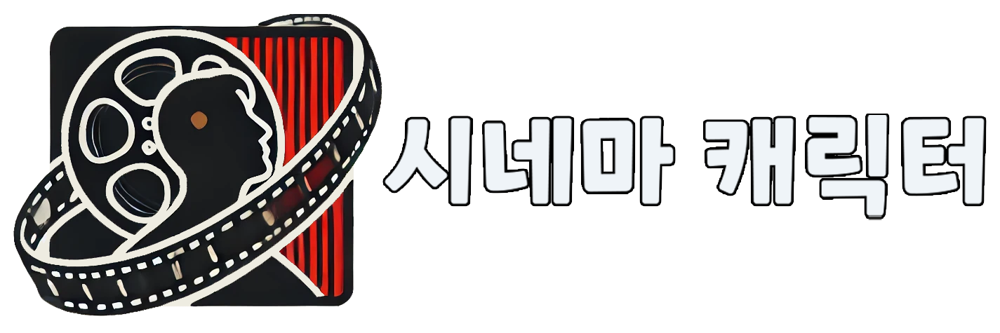
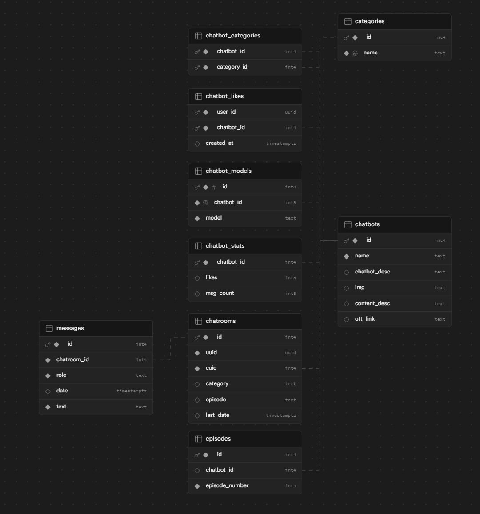

# 시네마 캐릭터

시네마 캐릭터는 영화와 드라마에 등장하는 캐릭터들과 1대1 채팅을 즐길 수 있는 AI 챗봇 서비스입니다. GPT 파인튜닝을 통해 각 캐릭터의 특성을 학습하여 실제 캐릭터와 대화하는 듯한 경험을 제공합니다.

## 기술 스택

- FullStack: Next.js
- Backend: Supabase
- Styling: Tailwind CSS 3.4.6, shadcn/ui
- AI: OpenAI GPT (파인튜닝 적용)

## 주요 기능

- 다양한 영화/드라마 캐릭터와의 1대1 채팅
- 캐릭터별 맞춤형 대화 경험
- 실시간 채팅 인터페이스
- 반응형 디자인을 통한 사용자 친화적인 UI/UX

## 데이터베이스 구조



## 시작하기

### 사전 요구사항

- Node.js (버전 18 이상 권장)
- npm 또는 yarn
- Supabase 계정 및 프로젝트 설정

### 설치

1. 저장소를 클론합니다:

```zsh
git clone https://github.com/character-chatbot/chatbot_web.git
```

2. 프로젝트 디렉토리로 이동합니다:

```zsh
cd chatbot_web
```

3. 의존성을 설치합니다:

```zsh
npm install
```

4. 환경변수 파일을 설정합니다(.env.local)

```env
NEXT_PUBLIC_SUPABASE_URL=
NEXT_PUBLIC_SUPABASE_ANON_KEY=
OPENAI_API_KEY=
```

5. 개발 서버를 실행합니다:

```zsh
npm run dev
```

6. 브라우저에서 `http://localhost:3000`으로 접속하여 애플리케이션을 확인합니다.

## 기여하기

프로젝트에 기여하고 싶으시다면 Pull Request를 보내주세요. 주요 변경사항은 먼저 이슈를 열어 논의해 주시기 바랍니다.
